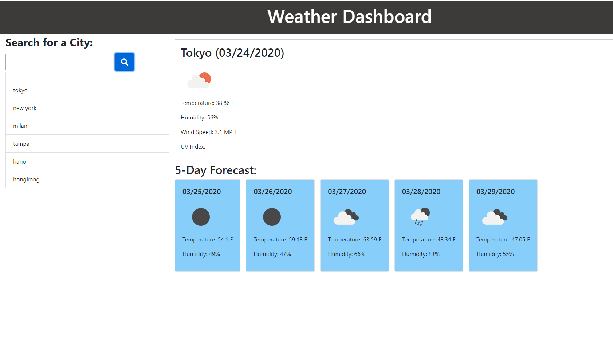

This weather dashboard app will run in the browser and feature dynamically updated HTML and CSS.

Use the OpenWeather API to retrieve weather data for cities. Use localStorage to store the search history.

Everything works pretty well except for clicking on the list of search history and the UV Index. I cannot get those 2 things to work.

https://ddavidson202020.github.io/Weather_Dashboard/

